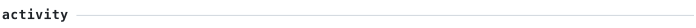
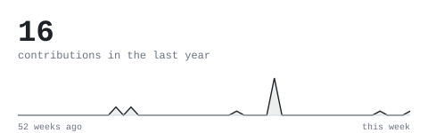
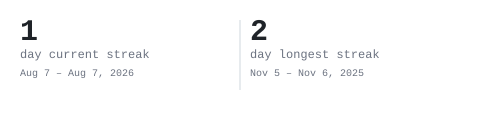

  

<b>Keyur Patel</b> <samp>· KeyurPat006</samp>

<blockquote>
Studying at UCF and building full-stack projects — from an AI-assisted 
project manager to small local-business sites — with an eye for 
accessible, deliberate interfaces.
</blockquote>

   
   
   
  

  <samp>Python · FastAPI · React · JavaScript · Tailwind CSS · Expo · Supabase · PostgreSQL</samp>

Everything above is generated inside this repository by a scheduled GitHub Action — no third-party widgets, no external requests.
